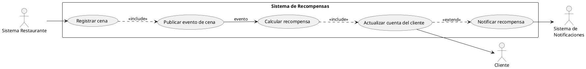
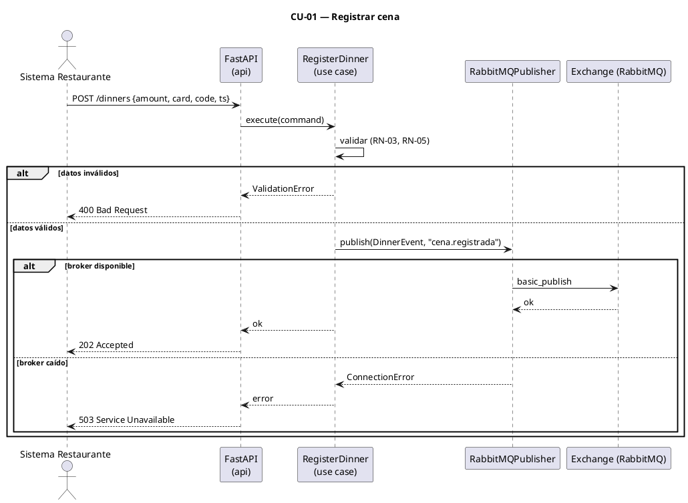
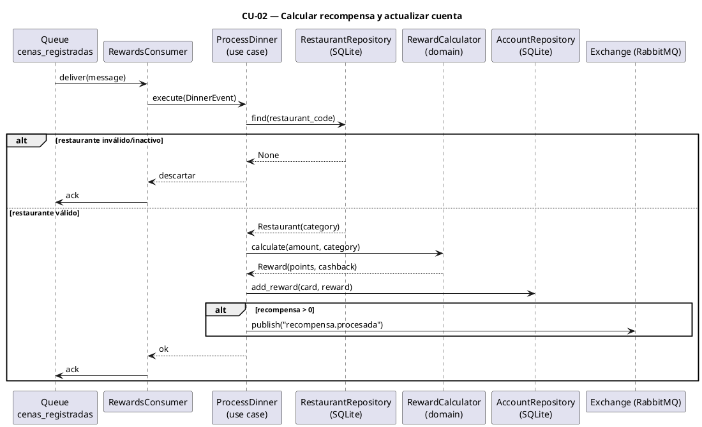
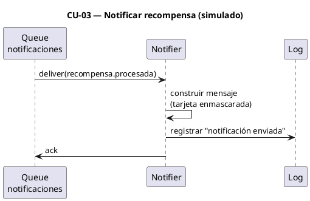

# Documento de Análisis y Diseño
## Sistema de Recompensas para Restaurantes

**Curso:** CS3081 - Ingeniería de Software (UTEC)
**Tarea:** 8 — Buen diseño: Cohesión y Acoplamiento
**Autor:** Sebastian Hernandez
**Fecha:** Mayo 2026

---

## 1. Introducción

El presente sistema implementa un **programa de fidelización para restaurantes**. Cuando un cliente cena en un restaurante afiliado, una parte de su consumo se transforma automáticamente en **puntos** y **cashback** que se abonan a su cuenta personal de recompensas.

El sistema se construye sobre una **arquitectura orientada a eventos (EDA)** con dos microservicios desacoplados que se comunican a través de un broker de mensajería **RabbitMQ (protocolo AMQP)**.

---

## 2. Arquitectura

### 2.1 Patrón arquitectónico

- **Event-Driven Architecture (EDA)**: la comunicación entre servicios es asíncrona mediante eventos publicados en RabbitMQ. El productor no espera respuesta del consumidor.
- **Clean Architecture** dentro de cada microservicio: separación en capas `domain` → `application` → `infrastructure`, donde las dependencias apuntan siempre hacia el dominio (regla de dependencia).

### 2.2 Componentes

| Componente | Rol | Tecnología |
|------------|-----|------------|
| **Restaurant Service** (Producer) | Registra la cena y publica el evento | FastAPI + pika |
| **RabbitMQ** (Broker) | Enruta y entrega mensajes | AMQP (Exchange → Routing → Queue) |
| **Rewards Service** (Consumer) | Valida restaurante, calcula recompensas, actualiza la cuenta y publica el evento de notificación | pika + SQLite |
| **Notifier** (Consumer) | Consume `recompensa.procesada` y simula el envío de la notificación (log) | pika |
| **Shared** | Contrato de eventos y serialización | dataclasses |

### 2.3 Topología AMQP

```
[Restaurant Service]
   │  publish(routing_key="cena.registrada")
   ▼
[Exchange: recompensas_exchange_Sebastian_Hernandez_t1  (direct)]
   │  routes
   ▼
[Queue: cenas_registradas_Sebastian_Hernandez_t1  (durable)]
   │  consume
   ▼
[Rewards Service] → calcula recompensa → actualiza cuenta (SQLite)
   │  publish(routing_key="recompensa.procesada")   (si recompensa > 0)
   ▼
[Queue: notificaciones_Sebastian_Hernandez_t1  (durable)]
   │  consume
   ▼
[Notifier (simulado)] → registra la notificación en log (sin proveedor real)
```

El productor publica al **exchange** (no conoce la cola), lo que garantiza **bajo acoplamiento**: cambiar la cola o agregar nuevos consumidores no afecta al productor.

Tras actualizar la cuenta, el Rewards Service publica un **segundo evento** `recompensa.procesada` al mismo exchange con otra routing key, que se enruta a la cola `notificaciones_Sebastian_Hernandez_t1`. Un componente *Notifier* la consume y **simula** el envío registrándolo en el log (con el número de tarjeta enmascarado). Esto evidencia el carácter orientado a eventos del sistema sin depender de un proveedor real de email/SMS.

### 2.4 Atributos de calidad atendidos

| Atributo | Cómo se logra |
|----------|---------------|
| **Alta cohesión** | Cada clase tiene una sola responsabilidad (calcular, publicar, persistir, notificar) |
| **Bajo acoplamiento** | Comunicación por eventos; dominio sin dependencias de infraestructura; interfaces (puertos) entre capas |
| **Modularidad** | Dos servicios independientes desplegables por separado + módulo compartido mínimo |
| **Escalabilidad** | Múltiples instancias del consumidor pueden leer de la misma cola (competing consumers) |
| **Resiliencia** | Cola durable + acknowledgements manuales + dead-letter para mensajes fallidos |

---

## 3. Reglas de negocio

| ID | Regla |
|----|-------|
| **RN-01** | Por cada **S/ 10** de consumo se otorga **1 punto** (división entera: `puntos = floor(amount / 10)`). |
| **RN-02** | El **cashback** es del **5%** del monto si el restaurante es *premium*, y **2%** si es *estándar*. |
| **RN-03** | Una transacción es válida solo si `amount > 0`. Montos cero o negativos se rechazan. |
| **RN-04** | El `restaurant_code` debe corresponder a un restaurante **afiliado y activo** registrado en la tabla `restaurants` (SQLite); si no existe o está inactivo, la transacción se descarta. La categoría (`premium`/`estándar`) usada en RN-02 se obtiene de este registro. |
| **RN-05** | El `card_number` debe tener un formato válido (13–19 dígitos numéricos). |
| **RN-06** | Las recompensas se **acumulan** en la cuenta del cliente (identificado por su número de tarjeta). |
| **RN-07** | Se envía notificación al cliente **solo si** la recompensa total calculada (puntos + cashback) es mayor que cero. |
| **RN-08** | El `card_number` nunca se almacena ni registra en logs en texto plano: se enmascara mostrando solo los últimos 4 dígitos. |

### Ejemplo de cálculo

> Cena de **S/ 250** en un restaurante *premium*:
> - Puntos: `floor(250 / 10)` = **25 puntos**
> - Cashback: `250 × 5%` = **S/ 12.50**

---

## 4. Casos de uso

### 4.1 Actores

- **Sistema Restaurante**: registra la cena del cliente (actor que inicia el flujo).
- **Cliente**: beneficiario de las recompensas (actor secundario).
- **Broker (RabbitMQ)**: intermediario de mensajería.
- **Microservicio de Recompensas**: calcula y abona las recompensas.
- **Sistema de Notificaciones**: informa al cliente (opcional).

### 4.2 Diagrama de Casos de Uso (PlantUML)



### 4.3 Especificación de casos de uso

#### CU-01 — Registrar cena
- **Actor principal:** Sistema Restaurante
- **Precondición:** El restaurante está afiliado y activo.
- **Flujo normal:**
  1. El sistema restaurante envía monto, número de tarjeta, código de restaurante y timestamp.
  2. El servicio valida los datos (RN-03, RN-04, RN-05).
  3. El servicio publica el evento `cena.registrada` en el exchange.
- **Flujos alternativos:**
  - *2a.* Datos inválidos → responde `400 Bad Request`, no publica.
  - *3a.* Broker no disponible → responde `503`, registra el error sin exponer stacktrace.
- **Postcondición:** El evento queda encolado en `cenas_registradas_Sebastian_Hernandez_t1`.



#### CU-02 — Calcular recompensa y actualizar cuenta
- **Actor principal:** Microservicio de Recompensas
- **Precondición:** Existe un evento en la cola.
- **Flujo normal:**
  1. El consumidor recibe el evento y lo deserializa.
  2. Consulta el restaurante en la tabla `restaurants` (RN-04) y obtiene su categoría.
  3. Calcula puntos (RN-01) y cashback según la categoría (RN-02).
  4. Acumula la recompensa en la cuenta del cliente (RN-06) en SQLite.
  5. Si la recompensa > 0, publica el evento `recompensa.procesada` (CU-03).
  6. Confirma el mensaje (ack).
- **Flujos alternativos:**
  - *1a.* Mensaje malformado → se envía a dead-letter, se hace ack para no bloquear la cola.
  - *2a.* Restaurante inexistente o inactivo → se descarta la transacción (ack), sin abonar recompensa.
  - *4a.* Error de persistencia → se hace nack y el mensaje se reencola.
- **Postcondición:** La cuenta del cliente refleja la nueva recompensa.



#### CU-03 — Notificar recompensa (evento simulado)
- **Actor principal:** Notifier (consumidor del evento de notificación)
- **Precondición:** Existe un evento `recompensa.procesada` en la cola `notificaciones_...` (solo se publica si la recompensa > 0, RN-07).
- **Flujo normal:**
  1. El Notifier recibe el evento `recompensa.procesada`.
  2. Construye el mensaje de notificación (tarjeta enmascarada, puntos, cashback).
  3. **Simula** el envío registrándolo en el log (sin proveedor real de email/SMS).
  4. Confirma el mensaje (ack).
- **Flujos alternativos:**
  - *1a.* Evento malformado → dead-letter + ack.
- **Postcondición:** Queda registrada la evidencia de que la notificación fue "enviada".



---

## 5. Requerimientos funcionales

| ID | Requerimiento |
|----|---------------|
| **RF-01** | El sistema debe permitir registrar una cena con: monto, número de tarjeta, código de restaurante y fecha/hora. |
| **RF-02** | El sistema debe validar los datos de la cena antes de publicarlos. |
| **RF-03** | El sistema debe publicar un evento en RabbitMQ tras un registro válido. |
| **RF-04** | El microservicio de recompensas debe consumir el evento y calcular puntos y cashback automáticamente. |
| **RF-05** | El sistema debe acumular y persistir las recompensas en la cuenta del cliente. |
| **RF-06** | El sistema debe permitir consultar el saldo de recompensas de un cliente. |
| **RF-07** | *(Opcional)* El sistema debe emitir una notificación cuando la recompensa es mayor que cero. |

---

## 6. Requerimientos no funcionales

| ID | Categoría | Requerimiento |
|----|-----------|---------------|
| **RNF-01** | Escalabilidad | El broker debe permitir múltiples instancias del consumidor leyendo de la misma cola. |
| **RNF-02** | Disponibilidad / Resiliencia | La cola es durable; los mensajes no se pierden ante caídas temporales del consumidor. |
| **RNF-03** | Mantenibilidad | Cobertura de pruebas ≥ 85%; sin code smells críticos en SonarQube. |
| **RNF-04** | Seguridad | El número de tarjeta se enmascara en logs; las credenciales se gestionan por variables de entorno. |
| **RNF-05** | Bajo acoplamiento | Productor y consumidor no comparten lógica de dominio; solo el contrato del evento. |
| **RNF-06** | Confiabilidad | Manejo explícito de errores de deserialización y persistencia con dead-letter / reencolado. |
| **RNF-07** | Portabilidad | Configuración externalizada en `.env`; el sistema corre con `pip install -r requirements.txt`. |

---

## 7. Modelo del evento (contrato)

```json
{
  "amount": 250.0,
  "card_number": "4111111111111111",
  "restaurant_code": "REST-001",
  "timestamp": "2026-05-30T20:15:00Z"
}
```

| Campo | Tipo | Validación |
|-------|------|------------|
| `amount` | float | > 0 |
| `card_number` | string | 13–19 dígitos |
| `restaurant_code` | string | restaurante afiliado activo |
| `timestamp` | string ISO-8601 | fecha/hora de la transacción |

---

## 8. Estrategia de pruebas

| Nivel | Alcance | Herramienta |
|-------|---------|-------------|
| Unitarias | Lógica de dominio: cálculo de puntos/cashback, validaciones | pytest |
| Aplicación | Casos de uso con dobles de prueba (mocks de publisher/repositorio) | pytest + unittest.mock |
| Integración | Flujo publicar/consumir con `pika` simulado y repositorio in-memory | pytest |
| Cobertura | Reporte `coverage.xml` (objetivo ≥ 85%) | pytest-cov |
| Estático | Reliability, Security, Maintainability, Duplications | SonarQube (`sonar-scanner`) |

---

## 9. Decisiones de diseño

1. **RabbitMQ con exchange `direct`** en lugar del default exchange: cumple el patrón Exchange→Routes→Queue del enunciado y desacopla al productor de la cola.
2. **SQLite tras una interfaz `AccountRepository`**: permite sustituir la persistencia por una implementación in-memory en las pruebas, mejorando la testabilidad y el desacoplamiento.
3. **Módulo `shared` mínimo**: solo contiene el contrato del evento y su (de)serialización, evitando duplicación entre servicios sin acoplar sus dominios.
4. **FastAPI en el productor**: expone la API REST de registro de cenas con validación declarativa (Pydantic) y documentación automática.
