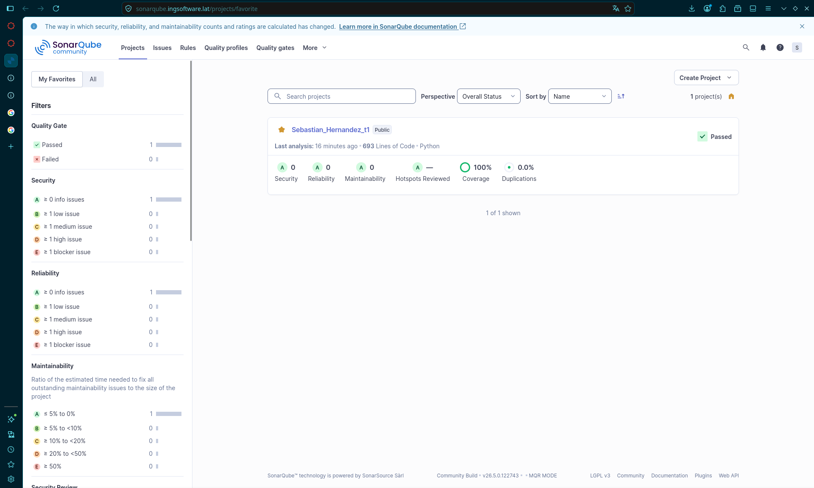
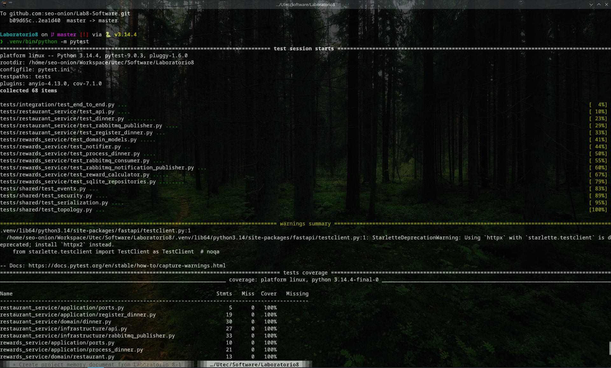
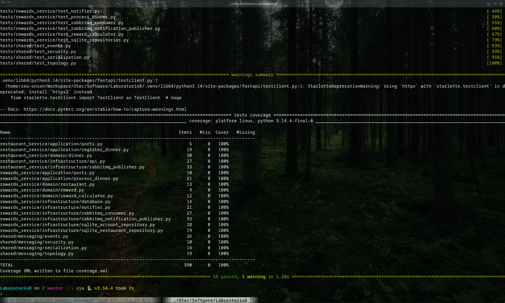

# Tarea 8 — Buen diseño: Cohesión y Acoplamiento

**Curso:** CS3081 - Ingeniería de Software (UTEC)
**Estudiante:** Sebastian Hernandez
**Sistema:** Programa de recompensas para restaurantes (arquitectura orientada a eventos)

---

## 1. Enlaces

| Recurso | Enlace |
|---------|--------|
| **Repositorio GitHub** | https://github.com/seo-onion/Lab8-Software |
| **Análisis SonarQube** | https://sonarqube.ingsoftware.lat/dashboard?id=Sebastian_Hernandez_t1 |

---

## 2. Análisis de calidad — SonarQube (Quality Gate: **PASSED**)

| Métrica | Resultado | Umbral |
|---------|-----------|--------|
| Quality Gate | ✅ **Passed** | — |
| Security | A (0 vulnerabilidades) | A |
| Reliability | A (0 bugs) | A |
| Maintainability | A (0 code smells) | A |
| Security Hotspots Reviewed | 100% | 100% |
| Coverage | **100%** | ≥ 85% |
| Duplications | 0.0% | ≤ 3% |



---

## 3. Evidencia de pruebas automatizadas

**68 pruebas** ejecutadas con `pytest`, **100% de cobertura** (requisito mínimo: 85%).

Comando ejecutado:

```bash
pytest
```





---

## 4. Arquitectura implementada

**Patrón:** Event-Driven Architecture (EDA) + Clean Architecture.

El sistema se compone de dos microservicios desacoplados que se comunican de
forma asíncrona a través de **RabbitMQ** (protocolo AMQP):

```
[Restaurant Service]  --publish-->  [Exchange -> Queue]  --consume-->  [Rewards Service]  --> SQLite
   (FastAPI, productor)               (RabbitMQ, AMQP)                  (cálculo + persistencia)
                                                                              |
                                                                      recompensa.procesada
                                                                              v
                                                                   [Notifier] (notificación simulada)
```

| Capa | Responsabilidad |
|------|-----------------|
| **domain** | Reglas de negocio puras (cálculo de puntos/cashback, validaciones) |
| **application** | Casos de uso y puertos (interfaces), sin dependencias de infraestructura |
| **infrastructure** | Adaptadores: RabbitMQ (pika), SQLite, API FastAPI |
| **shared** | Contrato de eventos y serialización (único punto compartido) |

**Principios de diseño evidenciados:**

- **Alta cohesión:** cada clase tiene una única responsabilidad.
- **Bajo acoplamiento:** los servicios solo comparten el contrato de mensajes; las
  capas dependen de abstracciones (puertos), no de tecnologías concretas.
- **Modularidad:** dos microservicios desplegables de forma independiente.
- **Escalabilidad:** múltiples consumidores pueden leer de la misma cola.

> El documento de análisis y diseño completo (reglas de negocio, casos de uso con
> diagramas, requerimientos funcionales y no funcionales) está en
> [`DESIGN.md`](https://github.com/seo-onion/Lab8-Software/blob/master/DESIGN.md)
> dentro del repositorio.
